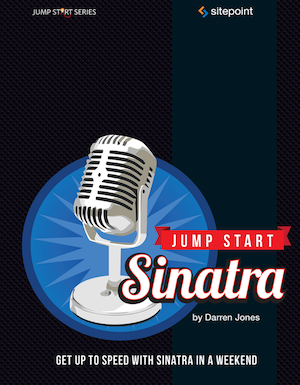

[](https://gitpitch.com/enogrob/ebook-project/master)
```
Roberto Nogueira  
BSd EE, MSd CE
Solution Integrator Experienced - Certified by Ericsson
```
# eBook Jumpstart Sinatra



**About**

Learn everything you need to about the subject of this `eBook` project.

[Homepage](https://www.sitepoint.com/premium/books/jump-start-sinatra)

## Topics
```
Sinatra Takes to the Stage
[x] What is Sinatra?
[x] Installing Sinatra
[x] Your first Sinatra App
[x] Variables and Named Parameters
[x] Creating a Betting Game
[x] Sinatra: The Safe Bet
Building a Basic Website
[x] Example Website: Songs By Sinatra
[x] ERB and Views
[x] Becoming Dynamic
[x] Adding Some Style
[x] Missing Pages
[x] Instance Variables
[ ] Start Your Engines
[ ] Partials
[ ] Getting Sassy
[ ] Take the Long View
Collecting Records
Setting up to Go Live
Helpers and Finders
Jazzing up with JavaScript
The Final Act
```
